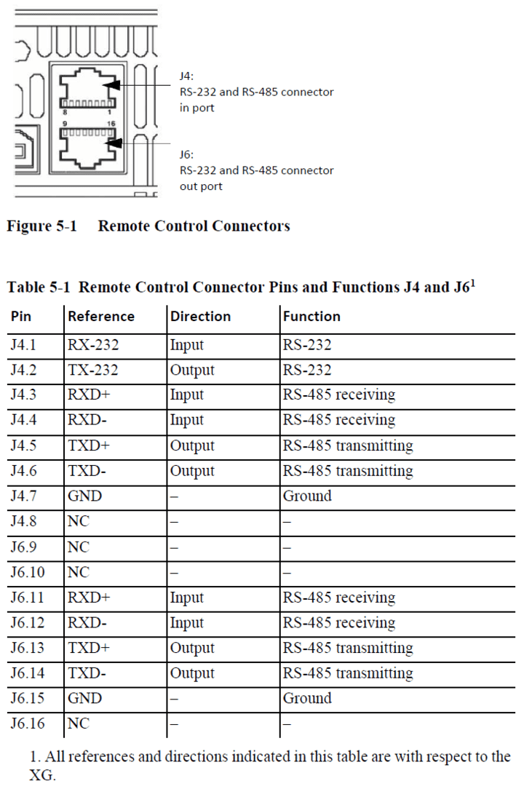

# AMETEK XG 850(6-110)

OS: Window 10
CON: RS-232(J4 port)

Remote operation using RS-232.

# Connector

# Configuration

## Select RS-232

- Turn the 9-position mode control to PGM.
- `rE` is displayed in the output voltage display.
- Turn the rotary Adjust/Enter control to select `232`.

## Set Data Rate

- Press the rotary Adjust/Enter control.
- `H6P5` is displayed on the output voltage display and the currently set data rate is displayed on the output current display.
- Turn the rotary Adjust/Enter control to select the desired data rate.
- Press enter to commit the new data rate.

## Set address

- Press the rotary Adjust/Enter control.
- `Addr` is displayed on the output voltage display.
- Turn the rotary Adjust/Enter control to select the desired multichannel address from 1 to 30.
- Press the rotary Adjust/Enter control to commit the new address.

# SCPI commands

All commands must be issued with a multichannel address or the device must be selected using the:

`*ADR <address>`

or

`:SYST[<channel>]:COMM[:MCH]:ADDR <address>`

Once a device is selected all commands sent without a multichannel address will be handled by the selected device.

# Setup file format

| Num | Voltage(V) | Current(A) | time(s) |
| --- | ---------- | ---------- | ------- |
| 1   | 1.525      | 3          | 60      |
| 2   | 2          | 3          | 60      |
| 3   | 3          | 1.255      | 3600    |

# Output file format

| Time                  | Voltage(V) | Current(A) |
| --------------------- | ---------- | ---------- |
| 2020-06-15 2:25:18 AM | 1.525      | 2.211      |
